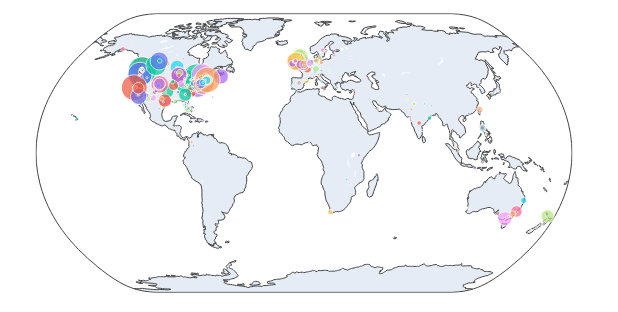

# Statement of need

Social media data can provide insights on people's perception or preferences of a specific topic. Even though getting a representative sample is often difficult or impossible, the text data available in platforms like Twitter are valuable for research, especially given that many entities, from politicians and companies to individual people use this platform to spread ideas, strategies, plans, and proposals. To make this data available to researchers, Twitter developed its own API, which is free for academic research. However, dealing with authentication, API calls, and data response handling can be overwhelming for researchers that have little to no experience in coding but still could highly benefit from the nature of this data. For this reason, we have developed `GTdownloader`, a high level package that offers easy access to the full-archive-search Twitter API endpoint and compiles the retrieved data in standard formats so they can more easily be further manipulated and analyzed. Although other interfaces exist to retrieve data from Twitter, we identified that none of them offer a simple approach for less experienced or first time programmers. The closest package identified in our search is `TTLocVis` [@Kant2020], which also offers geographical data pre-visualization; however, it offers mostly for static visualizations and it focuses mainly on topic modeling, which is out of the `GTdownloader` scope.

# Summary

The `GTdownloader` `TweetDownloader` class offers  methods to download and visualize the data interactively by leveraging the `Plotly`, `Matplotlib`, and `Wordlcoud` libraries. The query parameters available from the Twitter API can be passed as arguments of the downloading method `get_tweets()`. This reduces the chance of ambiguity, specially for first time users who may not be familiar with boolean operators within Twitter queries. One of the key features catered for less experienced users is the `tweets_from_csv()` method that reads all the query parameters from a table of parameters stored in csv format. This functionality enables the use of the API by writing just one single command line to run the script. 

Once a download is completed, the data can be exported in shapefile format to be used as needed. In addition to exporting the data, preliminary visualization methods are available to gain insights on the downloaded data.

### Static visualization

After downloading the tweets, one can quickly preview the centroids of the tweets by calling the `preview_tweet_locations()` method:

### Interactive maps
The interactive map displays a map in which tweet data such as text and location are displayed upon hovering. Panning, zooming in and out, and snap shot saving are available in the animation.

### Time animation
The time animation method allows the selection of a time unit to visualize the evolution of the number of tweets aggregated per location in time. This is an quick way to see if the downloaded data displays the expected temporal behavior before working on the actual dataset in detail. 

### Wordcloud
Note that we make use of the custom_stopwords parameter to exclude the query words and the http and https tags that may arise from url posting.

# Citations

Citations to entries in paper.bib should be in
[rMarkdown](http://rmarkdown.rstudio.com/authoring_bibliographies_and_citations.html)
format.

If you want to cite a software repository URL (e.g. something on GitHub without a preferred
citation) then you can do it with the example BibTeX entry below for @fidgit.

For a quick reference, the following citation commands can be used:
- `@author:2001`  ->  "Author et al. (2001)"
- `[@author:2001]` -> "(Author et al., 2001)"
- `[@author1:2001; @author2:2001]` -> "(Author1 et al., 2001; Author2 et al., 2002)"

# Figures

Figures can be included like this:

and referenced from text using \autoref{fig:example}.

Figure sizes can be customized by adding an optional second parameter:
{ width=20% }

# Acknowledgements

We acknowledge contributions from Brigitta Sipocz, Syrtis Major, and Semyeong
Oh, and support from Kathryn Johnston during the genesis of this project.

# References
