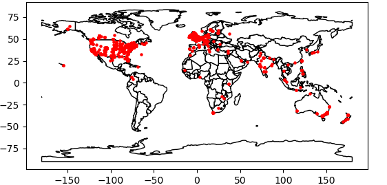

# Statement of need

Social media data can provide insights on people's perception or preferences of a specific topic. Even though getting a 
representative sample is often difficult or impossible, the text data available in platforms like Twitter are valuable 
for research, especially given that many entities, from politicians and companies to individual people use this 
platform to spread ideas, strategies, plans, and proposals. To make this data available to researchers, Twitter 
developed its own API {TwitterAPI}, which is free for academic research. However, dealing with authentication, API calls, and data 
response handling can be overwhelming for researchers that have little to no experience in coding but still could 
highly benefit from the nature of this data. For this reason, we have developed `GTdownloader`, a high level package 
that offers easy access to the full-archive-search Twitter API endpoint and compiles the retrieved data in standard 
formats so they can more easily be further manipulated and analyzed. Although other interfaces exist to retrieve data 
from Twitter ([@Barrie2021], [@Kearney2019]. [@stojanovski2014]), we identified that none of them offer a simple 
approach for less experienced or first time programmers.  The closest package identified in our search is `TTLocVis` 
[@Kant2020], which also offers geographical data  pre-visualization; however, it offers mostly for static 
visualizations and it focuses mainly on topic modeling, which  is out of the `GTdownloader` scope.

# Summary

The `GTdownloader` `TweetDownloader` class offers  methods to download and visualize the data interactively by 
leveraging the `Plotly` [@plotly], `Matplotlib` [@Hunter:2007], and `Wordlcoud` [@WordCloud] libraries. 
The query parameters available from the Twitter API can be passed as arguments of the downloading method `get_tweets()`. 
This reduces the chance of ambiguity, specially  for first time users who may not be familiar with boolean operators 
within Twitter queries. One of the key features  catered for less experienced users is the `tweets_from_csv()` method 
that reads all the query parameters from a table  of parameters stored in csv format. This functionality enables the 
use of the API by writing just one single command line to run the script. 

Once a download is completed, the data can be exported in shapefile format to be used as needed. In addition to 
exporting the data, preliminary visualization methods are available to gain insights on the downloaded data.

### Exporting data

The package supports exporting the tweets and all their data as tables in csv and xlsx formats. Additionally, the data
can be exported in shapefile format for its further geoprocessing and analysis using additional software. The only 
caveat regarding the geometries of the exported entities is that tweets are georeferenced by polygon geometries
corresponding to the most accurate available bounding box per tweet. The size of the bounding boxes can range from the
size of a single neighbourhood to the size of an entire country. We have also introduced a function to export point 
geometries obtained as the centroid of each bounding box. In order to assess the convenience of using these points as a
representation of the tweet locations, we recommend using the `place_type` attribute in the `places` dataframe of the
`TweetDownloader` class, which can be used as an indicator of the size of the place the centroid is representing. 

### Visualizing the data

Using the centroids obtained from the tweets bounding box locations, we introduced methods that use `matplotlib` and 
`Plotly` to display maps that offer a geographical insight into the downloaded data.

#### Static visualization

After downloading the tweets, one can quickly preview the centroids of the tweets by calling the 
`preview_tweet_locations()` method:

#### Interactive maps
The interactive map displays a map in which tweet data such as text and location are displayed upon hovering. Panning, 
zooming in and out, and snapshot saving are available in the animation by leveraging Plotly graphing methods. An extra 
time animation method allows the selection of a time unit to visualize the evolution of the number of tweets aggregated
per location in time. This is a quick way to see if the downloaded data displays the expected temporal  behavior before 
conducting exhaustive analysis on the data. 

#### Wordcloud
Note that we make use of the custom_stopwords parameter to exclude the query words and the http and https tags 
that may arise from url posting.

# Ongoing research 

This library is currently being used by the CSUN lab as one of the main data collection assets in a transportation 
oriented study that seeks to understand teh geographical distribution of sentiment towards telecommuting during
different stages of the COVID-19 pandemic.

# References
